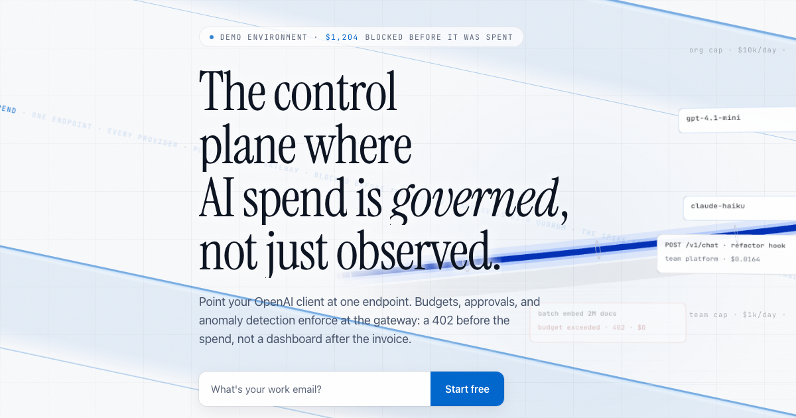
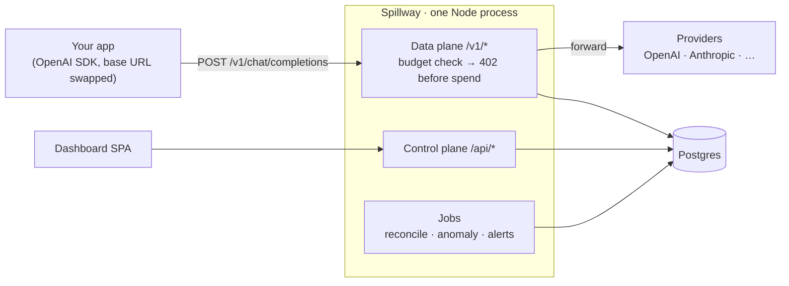

# Spillway



> **The control plane where AI spend is governed, not just observed.**
>
> **Live: [spillway.cloud](https://spillway.cloud)**

Point your OpenAI client at one endpoint. Budgets, approvals, and anomaly detection enforce **at the gateway** — a `402` before the spend, not a dashboard after the invoice.

A spillway is the channel that keeps a dam from bursting: it releases exactly the flow the structure can afford. Spillway does that for AI spend.

## Why

AI spend is the first line item in a decade that engineering can 10× overnight without telling finance. Observability tools show you the damage after the invoice lands. Spillway sits in the request path, so a budget isn't a chart — it's a hard limit the gateway enforces per request, before the tokens are bought.

## What it does

- **Drop-in gateway** — OpenAI-compatible `/v1/*` data plane. Swap the base URL, keep your SDK. Streaming included.
- **Hard budget enforcement** — hierarchical caps (org → team → virtual key) checked in-path. Over budget → `402` with a machine-readable error, not a Slack apology.
- **Approval workflows** — requests that would breach a cap can park for human approval instead of failing.
- **Anomaly detection + automation** — spike detection, alerting, and automated suspensions on runaway keys.
- **Reconciliation** — streamed responses are cost-reconciled after the fact; the ledger is decimal-safe USD, not float guesses.
- **Chargeback reporting** — per-team, per-key, per-model cost attribution finance can actually use.
- **Console** — a full dashboard SPA for budgets, keys, approvals, alerts, reports, and audit.

## Architecture



Two planes, one Fastify server: the data plane proxies and meters model traffic; the control plane serves the console and governance APIs. Postgres holds the ledger; background jobs reconcile streamed costs and watch for anomalies.

## Stack

| Layer | Tech |
| ----- | ---- |
| Server | TypeScript · Fastify 5 · Drizzle + postgres-js · zod · pino |
| Web | React 18 · Vite · TanStack Router/Query · Tailwind 4 |
| Packages | `@spillway/shared` (zod contracts, error taxonomy) · `@spillway/pricing` (decimal-safe cost math) |
| Infra | Docker → Fly.io · Neon Postgres · WorkOS AuthKit · GitHub Actions CI |

## Layout

```
apps/server       # gateway + control-plane API (data-plane / control-plane / services / db / jobs)
apps/web          # dashboard SPA
apps/landing      # static landing page
packages/shared   # cross-plane zod schemas, types, error taxonomy
packages/pricing  # price tables, decimal-safe USD cost math
packages/certifier# certification / verification logic
tools/            # seed, insights (Python), backup, openapi, stress
```

## Run it locally

```bash
pnpm install
cp .env.example .env        # fill in values — never commit .env
pnpm db:up                  # local Postgres (Docker)
pnpm db:migrate
pnpm dev                    # server (data + control + static), hot reload
pnpm dev:web                # dashboard SPA on :5173 (alongside)
```

Quality gates (mirror CI):

```bash
pnpm typecheck && pnpm lint && pnpm test    # unit — no DB needed
pnpm test:integration                       # requires Docker/Postgres
pnpm build
```

## Status

Active development. Gateway, governance engine (budgets, approvals, automation, alerts, reports), and the dashboard console are built and tested; insights surface and hardened deploy are in progress.

## License

Source-available for reading and evaluation. All rights reserved — no license is granted for commercial use or redistribution.
